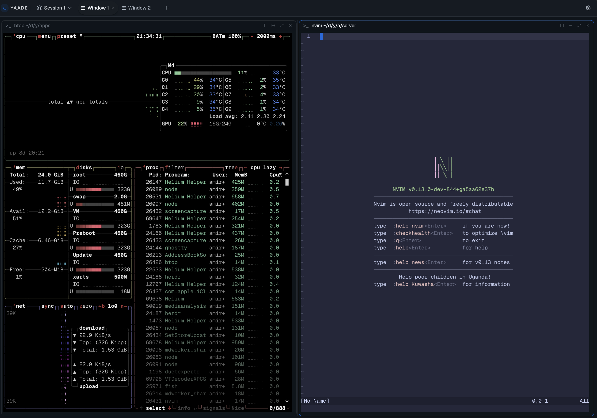

# YAADE 🤓

> **Multi-Client, Remote-First Terminal Multiplexer Built on libghostty and React.**

Run coding agents on the machine with the horsepower. Watch them from the machine with the keyboard. Reconnect from your phone when curiosity wins.



```text
┌──────────────────── your screens ────────────────────┐
│  browser            desktop            phone         │
└──────────┬───────────────┬────────────────┬───────────┘
           └───────────────┼────────────────┘
                           ▼
                  ┌─────────────────┐
                  │   YAADE host    │
                  │                 │
                  │  session        │
                  │  ├─ window      │
                  │  │  ├─ terminal │──▶ shell
                  │  │  └─ terminal │──▶ coding agent
                  │  └─ window      │──▶ long build you forgot about
                  └─────────────────┘
```

YAADE keeps terminals on the server and turns your browser or desktop app into a window onto them. Close the laptop, switch clients, lose Wi-Fi, come back later. Your process keeps running as long as the YAADE host does.

No agent dashboard. No browser-side runtime. No mysterious chat abstraction. Your agents are CLI programs in real terminals, exactly where they belong.

## `man yaade`

```text
NAME
    yaade: a terminal habitat for humans and coding agents

SYNOPSIS
    one host, many clients, an unreasonable number of terminals

FEATURES
    • sessions containing tabbed windows and tiled terminals
    • several clients attached to the same live terminal
    • remote hosts collected in one session switcher
    • reconnect and replay after refreshes or network hiccups
    • drag, split, dock, swap, and retile without stopping processes
    • keyboard-first desktop use and mobile-friendly controls
    • one React client shared by the browser and a lightweight Tauri desktop shell
    • libghostty-vt terminal parsing, rendered through React everywhere
```

## The topology

```text
Session
├── Window: feature/haunted-cache
│   ├── Terminal: nvim
│   └── Terminal: claude
├── Window: production-is-fine
│   ├── Terminal: logs
│   └── Terminal: htop
└── Window: definitely-not-procrastinating
    └── Terminal: cmatrix
```

A **Session** is your workspace. A **Window** is a tab. A **Terminal** is a server-side PTY running a shell, command, or coding agent.

The URL points straight at the current location:

```text
/?s=<session>&t=<window>&term=<terminal>
```

Bookmark it. Send it to another trusted client. Resume staring at the same blinking cursor.

## Boot sequence

You need Node.js 22.18+ and [Vite+](https://viteplus.dev/).

```bash
curl -fsSL https://vite.plus | bash
vp install
vp run dev
```

Open the web client, create a terminal, and launch your favorite agent CLI.

Want the native client instead?

```bash
vp run dev:desktop
```

The desktop app starts the bundled server as a background user service on the
default port. Closing the desktop window leaves the server and its terminals
running.

## Release

```bash
pnpm build
./dist/yaade serve
```

`pnpm build` produces one native Rust binary containing both the multiplexer API
and the web client. `yaade serve` listens on `http://127.0.0.1:7774` by default.
Use `--port` or `YAADE_PORT` to override it.

## Remote mode

Run the host where the code and compute live. Connect from somewhere more comfortable.

```bash
YAADE_HOST_TOKEN=replace-me \
  vp run dev:server -- --host 0.0.0.0 --token replace-me
```

Add that server from **Settings → Servers**. YAADE can keep multiple remote hosts in the same switcher.

> [!CAUTION]
> Binding outside loopback requires a token. Please do not put an unauthenticated shell portal on the public internet. The robots already have enough opportunities.

## Laws of the terminal universe

1. **The host owns the process.** Closing or refreshing a client does not stop the terminal.
2. **Closing a terminal means closing it.** YAADE stops its PTY and anything running inside.
3. **Restarting the host resets the universe.** Running terminals do not survive a host restart.
4. **Clients observe and control.** Agents execute on the server, never in the browser.

## Enter the engine room

Want to hack on YAADE? Read [AGENTS.md](AGENTS.md) before rearranging the spaceship. It has the development commands and the few rules keeping the warp core attached.

---

Built for people who think “I’ll just open one more terminal” is a reasonable plan.
